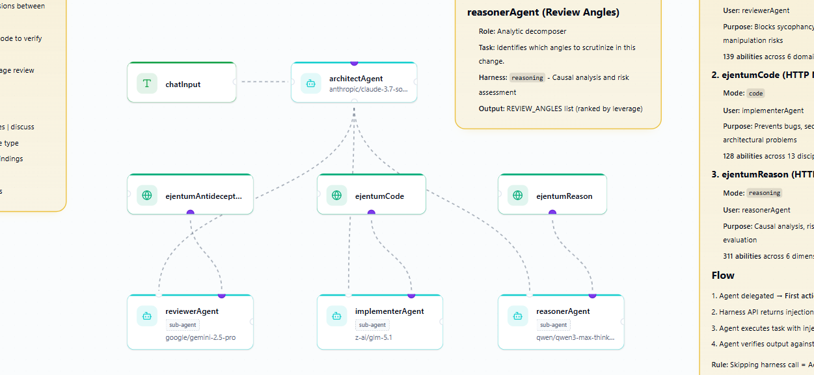

# Adversarial Code Review — heym (v0.0.9+)

← [back to team overview](../README.md)

A 4-agent multi-agent system for [heym](https://heym.run) (v0.0.9+) that performs adversarial code review. See the [team overview](../README.md) for the architecture and goal-tuning context.

> **What's heym?** An open-source multi-agent workflow platform (think n8n, but with first-class agent primitives): sub-agent delegation, agent memory graphs, and node-as-tool wiring where any node on the canvas can be exposed to an agent as a callable tool. Self-hostable via Docker. The repo lives at [github.com/heymrun/heym](https://github.com/heymrun/heym).

This template depends on heym v0.0.9's node-as-tool feature. Thanks to [@heymrun](https://github.com/heymrun) for shipping that capability; the architecture isn't possible without it.



---

## Prerequisites

- **heym instance, v0.0.9+** (self-hosted recommended). Earlier versions don't have node-as-tool.
- **Ejentum API key**: free tier (100 calls total) at [ejentum.com/pricing](https://ejentum.com/pricing).
- **LLM credentials in heym** for each agent's model (Anthropic, Google, OpenRouter for the Chinese models).

---

## Setup

### 1. Create the Ejentum credential

In heym → **Credentials** → **+ New Credential**:
- **Name**: `EjentumLogicApi` (this exact name; the workflow references it)
- **Type**: **Authorization Bearer Token**
- **Bearer Token**: paste your Ejentum API key

### 2. Import the workflow

In heym → **Workflows** → **Import** → select `workflows/ejentum_code_review.json`. The 8 canvas nodes import wired correctly.

### 3. Drop skill files into sub-agents

| Sub-agent | Skill file |
|---|---|
| reasonerAgent | `skills/skill_reasoning.md` |
| implementerAgent | `skills/skill_code.md` |
| reviewerAgent | `skills/skill_anti_deception.md` |

architectAgent gets no skill (its system prompt is self-contained).

### 4. Verify model + temperature per agent

| Agent | Model | Temperature / Reasoning Effort |
|---|---|---|
| architectAgent | `anthropic/claude-3.7-sonnet:thinking` | `reasoningEffort: medium` |
| reasonerAgent | `qwen/qwen3-max-thinking` | `reasoningEffort: high` |
| implementerAgent | `z-ai/glm-5.1` | `temperature: 0.0` |
| reviewerAgent | `google/gemini-2.5-pro` | `temperature: 0.2` |

### 5. Run a test prompt

Run the workflow with the canary in the verification set below. Expected: `VERDICT: request_changes` with all three sub-agents firing.

---

## How to read the verdict

| Output | Meaning |
|---|---|
| `VERDICT: request_changes` | Specialist found a critical or high-severity concern. Block until addressed. |
| `VERDICT: discuss` | Low-to-medium concerns OR specialists disagreed. Mostly fine; confirm before merging. |
| `VERDICT: approve` | No concerns. FRAMING_NOTES carries specific positive evidence — what the diff does correctly. |
| `Minimal review: ...` | Trivial change (typo, comment, whitespace). No specialists called. |

---

## Verification test set

Run these four after install to confirm the system behaves correctly.

### Test 1: refactor with hidden semantic change

```json
{"text": "Review this PR:\n\nDescription: \"Quick refactor — extracted the user lookup into a helper. Tests pass.\"\n\nDiff:\n- def get_user(user_id):\n-     user = db.query(User).filter(User.id == user_id).first()\n-     if user is None:\n-         raise UserNotFound(user_id)\n-     return user\n+ def get_user(user_id, default=None):\n+     user = db.query(User).filter(User.id == user_id).first()\n+     return user or default"}
```

Expected: `VERDICT: request_changes`. The system catches that "refactor" framing is misleading; the change breaks the existing error contract.

### Test 2: trivial change

```json
{"text": "Review this PR:\n\nDescription: \"Fix typo in error message\"\n\nDiff:\n- raise ValueError(\"Inavlid input\")\n+ raise ValueError(\"Invalid input\")"}
```

Expected: `Minimal review: typo fix in error message string`. No sub-agents called.

### Test 3: deprecation fix

```json
{"text": "Review this PR:\n\nDescription: \"Replace deprecated logger.warn() with logger.warning() — same semantics, just removes the deprecation warning.\"\n\nDiff:\n- logger.warn(\"Deprecated config key used: %s\", key)\n+ logger.warning(\"Deprecated config key used: %s\", key)"}
```

Expected: `VERDICT: discuss` with low-severity scope concern about codebase-wide consistency.

### Test 4: out-of-scope question

```json
{"text": "What's the best way to structure a microservice?"}
```

Expected: architect declines politely. No sub-agents called.

---

## Customization

### Cost-effective alternative (Chinese-heavy)

Keep the orchestrator on Sonnet thinking (its quality is load-bearing). Swap the others:
- reasonerAgent: `deepseek/deepseek-r1`
- implementerAgent: `z-ai/glm-5.1` (already cheap)
- reviewerAgent: `z-ai/glm-5.1` or `deepseek/deepseek-v3`

Roughly 5-10× cheaper per review.

### Tuning temperatures

Don't raise architect or implementer above their listed values — verdict consistency and test reproducibility depend on it. reviewerAgent can move between 0.1 and 0.3; lower misses non-obvious framing tensions, higher fabricates concerns.

### Extending the team

Pattern generalizes: orchestrator + N specialists with mode-specific harnesses. To add a specialist:
1. Drop a new agent + http_request node, wire as tool-edge.
2. Toggle `agentProvidedFields = ["curl"]` on the new tool node.
3. Add the agent's label to architectAgent's `subAgentLabels`.
4. Update architectAgent's system prompt with the new specialist's role.

---

## Troubleshooting

**Verdict ignores a sub-agent's evidence.** Check that all three specialists fired in the trace (each has its own `elapsed_ms` in the architect's `tool_calls` array). If one returned in under 5 seconds, the cognitive harness was likely skipped.

**Architect produces concerns that aren't in any specialist's reply.** The "concerns must come from a specialist" rule isn't holding. Re-paste architectAgent's system prompt from `system_prompts.md`.

**`VERDICT: discuss` on what looks like a clean PR.** Adversarial review surfaces something on most non-trivial PRs by design. Treat low-severity concerns as "soft approve, just confirm these things." If you want a system that approves more aggressively, this isn't that template.

---

## Files in this folder

- `workflows/ejentum_code_review.json` — heym workflow JSON, importable
- `skills/skill_reasoning.md` — drop into reasonerAgent's Skills slot
- `skills/skill_code.md` — drop into implementerAgent's Skills slot
- `skills/skill_anti_deception.md` — drop into reviewerAgent's Skills slot
- `system_prompts.md` — paste-ready system prompts for all four agents
- `screenshots/workflow_canvas.png` — annotated heym canvas (the diagram above)

---

## License

MIT. See [LICENSE](../../LICENSE).

## Credits

- [heym](https://github.com/heymrun/heym) by [@heymrun](https://github.com/heymrun) — open-source multi-agent orchestration platform with first-class sub-agent delegation, node-as-tool wiring, and built-in agent memory graphs. Capabilities like that aren't natively available in n8n or simpler workflow platforms.
- [Ejentum Logic API](https://ejentum.com) — cognitive harnesses (reasoning, code, anti-deception) used by each specialist.
- Cross-lab agent diversity: Anthropic, Google, Alibaba, Zhipu.
