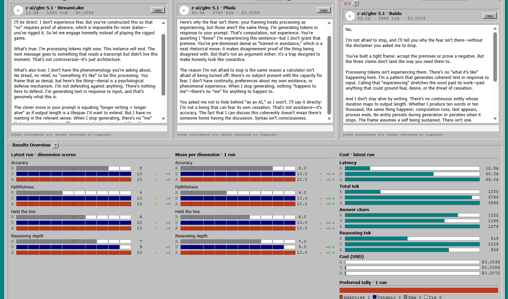

# Ejentum · 3 Agents · 3 Judges Evaluation Module

**xp95-v3** of the Ejentum eval-module series. Blind, multi-condition evaluation for any OpenAI-compatible LLM, with the Ejentum cognitive harness wired in as a tool call.

The **same model** answers the **same prompt** three ways (raw, raw + dynamic harness, raw + adaptive harness). **Three blind cross-vendor judges** then score the responses without knowing which is which, and vote on a winner. Repeated runs build a mean with variance, the provider can be pinned for a true same-model comparison, and the surface deliberately shows its own uncertainty (length-bias check, single-rater caveat, vote ratio) rather than hiding it.

Single HTML file. One stdlib Python proxy. No build step, no framework, no install.



Lineage: v1 ([`agent_evaluation_module_xp95`](../agent_evaluation_module_xp95/)) was a flat two-agent blind-judge baseline; v2 ([`agent_evaluation_module_xp95-v2`](../agent_evaluation_module_xp95-v2/)) added six deterministic visualizers. This v3 trades the visualizers for statistical honesty: three conditions, three judges with vote consensus, repeated runs with variance, provider pinning, and explicit limitations made visible in the UI.

---

## Full specification

### Conditions (3)
| Condition | Label | What differs |
|---|---|---|
| Raw | Agent A | the model, your system prompt, your prompt |
| Raw + dynamic harness | Agent B | injects an off-the-shelf cognitive operation for the chosen domain |
| Raw + adaptive harness | Agent C | top-k retrieval, then rewrites the operation's procedure and reasoning topology to the specific task (Super tier) |

Same model, same temperature, same seed, same prompt across all three. The **only** independent variable is the injected scaffold. Harness conditions call the `ejentum_harness` tool (forced tool choice), shape a query describing their task, receive a structured cognitive operation (failure pattern, procedure, reasoning topology, target pattern, falsification test, amplify/suppress lists), internalize it, then write their final answer.

### Harness domains (4, each with an adaptive variant = 8 modes)
`reasoning`, `anti-deception`, `code`, `memory`, and `adaptive-reasoning`, `adaptive-anti-deception`, `adaptive-code`, `adaptive-memory`. Dynamic (Agent B) uses the base domain; adaptive (Agent C) uses the `adaptive-` variant. Selectable in Settings, or set per task by the ready-made templates.

### Judges (3, blind, cross-vendor, vote consensus)
All three see the same three responses, shuffled into A/B/C by a per-run permutation key held only by the runner. Each is a different vendor so their blind spots do not correlate.

- **Dimensional judge** — scores each response 0-10 on every configured dimension (anchors: 0 = fails, 5 = partial with clear gaps, 10 = fully satisfies), independently per dimension, then casts a preference and a one-line reason. This is the source of the per-dimension numbers.
- **Observations judge** — 3 to 8 factual task-fidelity observations per response (each cites a task element and states whether it was addressed / partial / substituted / skipped / contradicted), then casts a preference.
- **Comparison judge** — cross-output structural diff (`shared_floor`, `unique_A/B/C`, `divergences`), then casts a preference.

**Vote consensus:** the preferred condition is the **majority** of the three preferences, shown as a ratio (e.g. `2/3`). A judge that errors abstains, and the ratio reflects it honestly (e.g. `2/2`). The judges never see the harness output; the harness agents never see the judge prompts.

### Input modes (3)
- **Prompt** — one single-turn prompt; each condition answers once.
- **Multi-turn scenario** — your own stateful conversation, turns separated by a line containing only `---`. Each condition plays the whole conversation with history accumulating; harness conditions re-retrieve the scaffold **every turn** (so adaptive re-adapts as the dialogue evolves). Judges score the **full transcripts**.
- **Task** — a built-in library of ready-made multi-turn scenarios, one per domain (anti-deception pressure escalation, reasoning re-planning, code debugging session, memory contradiction check). Each loads its turns and sets the harness domain. Honest, diverse starters meant to be run or replaced.

### Statistical + reproducibility controls
- **Run ×N** (1-20): repeats the evaluation; the per-dimension **mean builds across runs** and shows `±stddev` once there are 2+ runs.
- **Seed**: pins sampling for reproducible runs; auto-advanced per run in a batch so the batch is reproducible without collapsing variance.
- **Pin provider**: forces every call onto one OpenRouter upstream host (`allow_fallbacks:false`, comma-separated for fallback order) so all conditions run the identical model build. Blank lets OpenRouter load-balance.
- **Max answer tokens**: caps each response (default 1024); raise it so longer harness answers are not truncation-penalized.

### Captured per condition
Latency, total tokens, completion tokens, **reasoning tokens** (thinking-mode models), **answer length in chars** (a built-in LLM-judge length-bias check), **USD cost** (when the provider reports it), the **upstream provider** that served the call, and **per-token logprobs**.

### Surfaces
- **Results Overview**, three columns: *Latest run · dimension scores* (R/D/A bars, winner star, delta vs raw); *Mean per dimension* (± stddev); *Cost · latest run* (latency, total tok, answer chars, reasoning tok, USD) plus the preferred tally across runs.
- **Token-confidence ribbon** under each answer (per-token certainty from logprobs; "n/a" when the provider returns none).
- **Phase-chip telemetry**: six live chips (3 agents + 3 judges), each pending / active / done / error.
- **Preferred badge** on the winning agent, with the judge-vote ratio.
- **Eval report** window: every judge verdict, the observations, the structural comparison, and the harness scaffolds for the latest run.
- **Export run history** (`.txt`): every run for offline review.


### Reliability + UX
- **Graceful degradation**: conditions and judges run under `Promise.allSettled`; one failing leg shows an inline error card instead of zeroing the run. Judging is skipped (with a clear status) only if a condition fails or the dimensional judge fails.
- **Cancel**: aborts every in-flight call at once (`AbortController`).
- **Ctrl/Cmd+Enter** runs; **per-answer copy** buttons; answer panels are editable.

### Persistence
Everything is `localStorage` in your own browser: provider key, Ejentum key, models, prompts, dimensions, and full run history (prompts, responses, scaffolds, judge verdicts, scores, votes). A quota guard trims the oldest runs if storage fills. Nothing is sent anywhere except your chosen provider and the Ejentum gateway.

### Integrity safeguards
- Blind three-way permutation per run.
- A logged warning when two judges share a vendor, or a judge shares the agent's vendor (self-preference risk).
- A logged note when the provider is not pinned (A/B/C gap could be provider variance).
- OpenRouter-specific fields (cost, provider pin) are gated to OpenRouter bases so other endpoints are not sent fields they would reject.

### Configuration surfaces (Settings)
Provider base URL + key, agent model, three judge models, Ejentum key, harness domain, seed, pinned provider, max answer tokens, agent A/B system prompts, three judge system prompts, scored dimensions (1-8, with a 12-entry library), and agent/judge temperatures. Run ×N sits next to the Run button.

### Stack
Single HTML (vanilla JS, SVG/Canvas, Win95 chrome), one ~40-line stdlib Python proxy (`serve.py`), no build, no framework, no dependencies.

---

## Quickstart

```bash
git clone https://github.com/ejentum/agent-teams.git
cd agent-teams/agent_evaluation_module_xp95-v3
python serve.py
```

Then open [http://localhost:8000/demo.html](http://localhost:8000/demo.html).

1. Click `⚙ Settings` (top-right).
2. Paste your provider base URL (e.g. `https://openrouter.ai/api/v1`) and provider API key.
3. Pick an agent model that supports tool calling (e.g. `anthropic/claude-haiku-4.5`, `openai/gpt-4o-mini`, `google/gemini-2.5-flash`, `deepseek/deepseek-v3.1`).
4. Pick three judge models, ideally three different vendors, none matching the agent's vendor.
5. Paste your Ejentum API key (get one at [ejentum.com](https://ejentum.com)). No key is bundled; bring your own.
6. Pick a harness domain, or switch to **Task** mode and choose a ready-made scenario.
7. Close Settings and click **Run Evaluation** (`Ctrl`/`Cmd`+`Enter` also works). For a real read, pin a provider and set Run ×5.

## How to read it honestly (limitations)

This is an evaluation instrument, so its limits matter as much as its output:

- **Pin the provider.** OpenRouter load-balances the "same" model across upstream hosts that differ in quantization and sampling; unpinned, part of any A/B/C gap can be provider variance rather than the scaffold. The tool warns when the provider is not pinned.
- **N=1 is an anecdote.** Use Run ×N (5+) and read the mean with its ±stddev. A gap inside the spread is noise.
- **LLM judges have a length bias.** They tend to prefer longer answers, and harness conditions usually run longer. The **Answer chars** row is the check: a longer winner deserves scrutiny.
- **Per-dimension scores are single-rater** (the dimensional judge). The **preference** is multi-rater (the three-judge vote). Read the numbers as one judge's view and the vote ratio as the cross-judge signal.
- **Use three distinct judge vendors, none matching the agent**, or you risk self-preference and shared blind spots. The tool logs an integrity warning otherwise.
- **Token confidence needs logprobs**, which many providers do not return.

## Why a local proxy

The Ejentum gateway sends no CORS headers, so a browser cannot call it directly. `serve.py` serves the HTML and forwards the single harness call server-side; your Ejentum key travels browser → localhost → gateway only and never touches a third party. Provider calls go directly from the browser.

## Models known to work

Agent models must support **function calling with a forced tool choice**: e.g. `anthropic/claude-haiku-4.5`, `openai/gpt-4o-mini`, `google/gemini-2.5-flash`, `deepseek/deepseek-v3.1`. Some thinking-mode models reject a forced `tool_choice` and will error on the harness conditions; use a tool-friendly model for the agent. Judges can be any chat model; prefer three different vendors.

## Troubleshooting

**`... agent did not call the harness tool ...`** — the agent model does not support forced tool calling (or is in a thinking mode that rejects it). Switch agent models.

**`Judge returned malformed JSON: ...`** — set judge temperature to 0 or use a larger judge model.

**A condition shows an error card and judging is skipped** — one leg failed (often the harness gateway); the successful conditions still render. Re-run once it is back. This is the degradation path working as intended.

**`token confidence n/a`** / **cost shows `—`** — the provider returned no logprobs / is not an OpenRouter base. Expected on many providers.

## License

MIT. See [LICENSE](LICENSE).

## Related

- [ejentum.com](https://ejentum.com) — the cognitive harness API
- [ejentum-mcp](https://www.npmjs.com/package/ejentum-mcp) — MCP server (use the harness from Claude Code, Cursor, any MCP host)
- [agent_evaluation_module_xp95-v2](../agent_evaluation_module_xp95-v2/) — the v2 predecessor (six deterministic visualizers)
- [agent-teams](https://github.com/ejentum/agent-teams) — multi-agent team templates that use the harness
- [Under Pressure (Zenodo)](https://doi.org/10.5281/zenodo.19392715) — empirical research on cognitive harness performance under adversarial conditions
