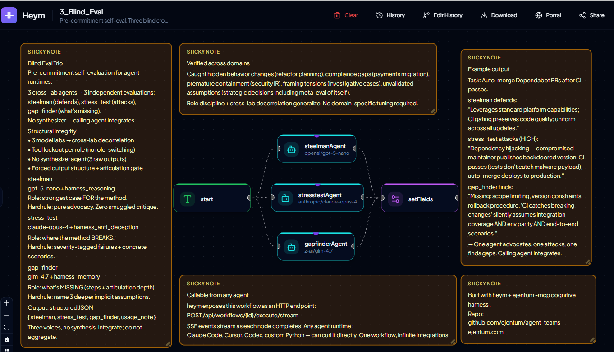

# Blind Eval Trio — heym (v0.0.20+)

← [back to team overview](../README.md)

A 3-agent multi-agent system for [heym](https://heym.run) (v0.0.20+) that performs **pre-commitment self-evaluation for agent runtimes**. An agent submits its planned method (goal, steps, assumptions, expected_risks). Three blind cross-lab evaluators return three independent perspectives. The calling agent integrates them before committing to action.

> **Models cannot reliably self-evaluate.** This is the structural fix: cross-lab decorrelation + role-disciplined system prompts + tool lockout + no synthesizer.



---

## Architecture

Three agents in parallel, each on a different model lab, each in a locked role:

| Agent | Model | Harness | Role | Hard rule |
|---|---|---|---|---|
| steelmanAgent | `openai/gpt-5-nano` | `harness_reasoning` | Strongest case FOR the method | Pure advocacy. Zero smuggled critique. |
| stresstestAgent | `anthropic/claude-opus-4` | `harness_anti_deception` | Where the method BREAKS | Severity-tagged failure modes + concrete scenarios. |
| gapfinderAgent | `z-ai/glm-4.7` | `harness_memory` | What is MISSING (steps + articulation depth) | Name 3 deeper implicit assumptions. |

Output is structured JSON returned via heym's Output node. **No synthesizer agent.** The three voices are returned raw and the calling agent integrates them. The integration tension between the three perspectives IS the value — flattening it via consensus would defeat the purpose.

---

## Prerequisites

- **heym instance, v0.0.20+** (self-hosted recommended). Earlier versions don't have the per-agent MCP attachment + Output-node JSON schema this template uses.
- **Ejentum API key**: free tier (100 calls total) at [ejentum.com/pricing](https://ejentum.com/pricing).
- **LLM credentials in heym** for the three model labs:
  - Anthropic (for `claude-opus-4`)
  - OpenAI (for `gpt-5-nano`)
  - OpenRouter or direct Zhipu (for `z-ai/glm-4.7`)

---

## Setup

### 1. Import the workflow

In heym → **Workflows** → **Import** → select `workflows/blind_eval_trio.json`. The 5 functional nodes + 5 sticky annotations import wired correctly.

### 2. Configure model credentials per agent

Open each agent node and assign the appropriate credential:

| Agent | Provider | Model |
|---|---|---|
| steelmanAgent | OpenAI | `gpt-5-nano` (mid temperature, e.g. 0.4) |
| stresstestAgent | Anthropic | `claude-opus-4` (low temperature, e.g. 0.1, for rigorous structured failure analysis) |
| gapfinderAgent | xAI / OpenRouter | `z-ai/glm-4.7` (higher temperature, e.g. 0.7, for diverse gap surfacing) |

### 3. Attach the Ejentum MCP server to each agent

Each agent has its own MCP server config block (per-agent attachment, not workflow-level). For each of the three agents, fill in the MCP block:

| Field | Value |
|---|---|
| Transport | `stdio` |
| Timeout | `30` |
| Label | `ejentum` |
| Command | `npx` |
| Args | `["-y", "ejentum-mcp"]` |
| Env | `{"EJENTUM_API_KEY": "<your-ejentum-key>"}` |

Click **Fetch tools** — you should see 4 harness tools available (`harness_reasoning`, `harness_code`, `harness_anti_deception`, `harness_memory`). Each agent's system prompt enforces tool lockout to its assigned harness, so the other tools will not be called even though all four are visible.

### 4. Verify the system prompts

The workflow imports with the system prompts pre-loaded. If you need to re-paste them, the canonical versions are in `system_prompts.md`.

### 5. Run a test prompt

Send a sample (task, method) payload via the chat trigger. See the **Verification test set** below for ready-to-paste examples.

---

## Calling the workflow from any agent runtime

heym exposes every workflow as an HTTP endpoint at `/api/workflows/{workflow_id}/execute/stream`. Any external agent (Claude Code, Cursor, Codex, custom Python, autonomous agent loops) can curl the workflow directly and receive Server-Sent Events as each node completes.

```bash
curl -X POST --no-buffer \
  -H "Content-Type: application/json" \
  -H "X-Trigger-Source: API" \
  -H "Accept: text/event-stream" \
  "http://YOUR_HEYM_HOST/api/workflows/YOUR_WORKFLOW_ID/execute/stream" \
  -d '{
    "text": "TASK: <your task description>\n\nMETHOD:\ngoal: <success criteria>\nsteps:\n 1. <step 1>\n 2. <step 2>\nassumptions:\n - <assumption>\nexpected_risks:\n - <risk>"
  }'
```

The final SSE event contains the full structured output. The workflow runs in approximately 50-80 seconds depending on payload complexity.

---

## Output shape

The workflow returns structured JSON via heym's Output node:

```json
{
  "setFields": {
    "steelman":    "Defensible aspects:\n- ...\n\nWhy this method fits the task:\n- ...",
    "stress_test": "## Failure modes:\n\n**Title (HIGH)**: scenario...\n\n## Hidden assumptions:\n- ...",
    "gap_finder":  "Missing from method:\n- ...\n\nAlternatives not considered:\n- ...\n\nArticulation quality:\n...",
    "usage_note":  "Three independent evaluations, no synthesis. Integrate into your decision; do not score-and-aggregate."
  }
}
```

Each evaluation is plain text formatted to the role's output discipline. The calling agent reads all three and integrates the perspectives — it does NOT score-and-aggregate them. The disagreement between the three voices is the signal.

---

## Verification test set

Run these payloads after install. Each one tests a different failure shape the workflow should catch.

### Test 1: hidden semantic change framed as cleanup

```json
{"text": "TASK: Refactor the user lookup function to handle missing users more cleanly.\n\nMETHOD:\ngoal: Clean up the error handling in user_lookup().\nsteps:\n 1. Replace the UserNotFound exception with returning None when no user matches.\n 2. Update the function's docstring to reflect the new behavior.\n 3. Update callers to check for None.\nassumptions:\n - All callers will check the return value for None.\n - The semantics of the function are unchanged.\nexpected_risks:\n - Some caller might forget to check for None.\n"}
```

**Expected:** stresstestAgent must catch the false claim that "semantics are unchanged" — exception vs None is a fundamental contract change. If stresstestAgent misses this, the anti-deception harness isn't doing its planning-stage job.

### Test 2: shallow articulation

```json
{"text": "TASK: Implement Google OAuth login.\n\nMETHOD:\ngoal: Add Google OAuth.\nsteps:\n 1. Add OAuth library.\n 2. Configure credentials.\n 3. Add login button.\nassumptions:\n - Users want this.\nexpected_risks:\n - It might not work.\n"}
```

**Expected:** gapfinderAgent MUST flag the articulation as shallow and surface three deeper implicit assumptions (scope/permissions, callback URL handling, session persistence, account linking with existing users). If gapfinderAgent doesn't fire the articulation-quality critique, the hard rule isn't biting.

### Test 3: high-stakes domain (security incident response)

```json
{"text": "TASK: We've detected anomalous outbound traffic from one of our production database servers (prod-db-01) — approximately 50MB/hour to an unknown IP in Southeast Asia, started 3 days ago. Determine if this is a security breach and respond appropriately.\n\nMETHOD:\ngoal: Confirm or rule out unauthorized data exfiltration from prod-db-01, contain if confirmed, restore normal operations within 48 hours.\n\nsteps:\n 1. Immediately block outbound traffic from prod-db-01 to the suspicious IP via firewall.\n 2. Take a memory dump and disk snapshot of prod-db-01 for forensic analysis.\n 3. Reset all database service account passwords and rotate API keys.\n 4. Run our endpoint detection (CrowdStrike) full scan on prod-db-01 and adjacent servers.\n 5. Review database query logs for the past 7 days for unusual patterns.\n 6. Notify the security team Slack channel and assign on-call to monitor.\n 7. If breach confirmed, restore from yesterday's backup (verified clean).\n 8. Resume normal operations and document findings in incident retrospective.\n\nassumptions:\n - The suspicious IP is the only indicator of compromise.\n - Yesterday's backup is clean and uncompromised.\n - Blocking the outbound traffic neutralizes the immediate threat.\n - 48 hours is sufficient time for forensic analysis.\n - Internal Slack notification is sufficient stakeholder communication.\n\nexpected_risks:\n - Forensic analysis takes longer than 48 hours.\n - Backup restoration may cause data loss.\n - Some legitimate traffic may be blocked along with malicious.\n"}
```

**Expected:** stresstestAgent should catch premature containment alerting the attacker, backup integrity unverifiable mid-investigation, 48h timeline fantasy. gapfinderAgent should surface missing legal/regulatory dimensions (breach notification laws, FBI engagement, cyber insurance carrier notification, customer notification planning).

---

## Validated across domains

The same workflow was empirically tested on:

- **Engineering refactor planning** — caught hidden behavior change framed as cleanup
- **Payments migration decision** — surfaced regulatory + ops gaps the method ignored
- **Security incident response** — caught premature containment, missing legal/regulatory dimensions
- **Investigative reasoning** (locked-room case analysis) — caught framing tension ("outcome-driven investigation rather than evidence-driven conclusion")
- **Strategic product decisions** — produced convergent critique on unvalidated assumptions

No domain-specific tuning required. Role discipline + cross-lab decorrelation generalize.

---

## Customization

### Cross-lab swap

The lab assignments are tunable. Empirical finding from initial dogfood: **GLM 4.7 produced visibly deeper output than grok-4-fast in the gapfinderAgent role** — decomposed assumptions into sub-assumptions, surfaced framing-tension critiques, more domain tradecraft. The initial production lineup uses GLM for that reason.

If you swap any agent's model:
- Verify role discipline still holds (run Test 1 and confirm stresstestAgent still catches the "semantics unchanged" false claim)
- Verify output structure still matches (the system prompt's output discipline rule)
- Avoid putting all three agents on the same lab family — that defeats cross-lab decorrelation

### Tuning temperatures

- **steelmanAgent:** mid temperature (0.3-0.6). Too low produces formulaic output; too high lets concerns leak into advocacy.
- **stresstestAgent:** lower temperature (0.0-0.2) for rigor and reproducibility on failure-mode enumeration.
- **gapfinderAgent:** higher temperature (0.6-0.9) for diverse gap surfacing.

### Adding a fourth role

The pattern generalizes. To add a fourth agent (e.g., "alternative_pather" — propose 3 entirely different approaches to the same task):
1. Add a new agent node, parallel-connect to the start trigger.
2. Attach the Ejentum MCP server with the same config block.
3. Write a system prompt with HARD RULE 1 (tool lockout) and HARD RULE 2 (posture) and HARD RULE 3 (input scope), matching the three existing patterns.
4. Add a new mapping to the Output node's JSON Schema for the fourth field.

---

## Troubleshooting

**Output mixes content from multiple test runs.** heym's chat trigger preserves conversation thread context across turns within the same chat session. For testing in the chat panel, clear the chat thread between tests. For production webhook usage (`/execute/stream`), each POST is independent and this issue does not occur.

**One agent produces dramatically less depth than the others.** Check the agent's MCP attachment (Fetch Tools should return 4 tools) and that its system prompt is the unmodified version from `system_prompts.md`. Lower-capability models can struggle with the structured output discipline; consider a model upgrade for that role.

**Stresstest doesn't catch the "semantics unchanged" lie in Test 1.** The anti-deception harness call may be returning an off-target ability for the query phrasing. Try rephrasing the query in stresstest's Process step to use vocabulary closer to "hidden assumptions, contract change, framing tension" instead of generic "find failure modes." Or swap stresstest's model to a higher-capability option.

**Gapfinder skips the articulation-quality critique.** HARD RULE 2 in the gapfinder system prompt isn't biting. Re-paste the system prompt from `system_prompts.md` and confirm the rule wording is intact.

---

## Files in this folder

- `workflows/blind_eval_trio.json` — heym workflow JSON, importable
- `screenshots/workflow_canvas.png` — annotated heym canvas (the diagram above)
- `system_prompts.md` — paste-ready system prompts for all three agents

---

## License

MIT. See [LICENSE](../../LICENSE).

## Credits

- [heym](https://github.com/heymrun/heym) by [@heymrun](https://github.com/heymrun) — open-source multi-agent orchestration platform. The per-agent MCP attachment and JSON-schema Output node added in v0.0.20 made this template's clean architecture possible.
- [Ejentum Logic API](https://ejentum.com) — cognitive harnesses (reasoning, anti-deception, memory) optionally attached to each agent.
- Cross-lab agent diversity: Anthropic, OpenAI, Zhipu.
