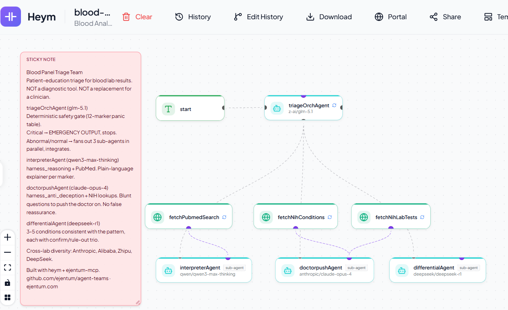

# Blood Panel Triage Team — heym (v0.0.30+)

A 4-agent multi-agent system for [heym](https://heym.run) that turns a raw blood panel into a structured patient-education report. Architecturally distinct from generic LLM "medical Q&A" systems in three ways: a **deterministic Python safety gate** that short-circuits to emergency output without ever calling an LLM, **role-locked sub-agents** with hard rules suppressing their most likely failure modes, and **cross-lab model diversity** (Anthropic + Alibaba + DeepSeek) stacked with **per-agent Ejentum cognitive harnesses** (reasoning + anti-deception) attached via MCP.

> **What this is for:** patient education and pre-doctor-visit triage. **NOT a diagnostic system. NOT a replacement for a licensed healthcare provider.** The output is structured information to help a patient understand their lab values and prepare for a clinical conversation.

This template requires heym v0.0.30+ for `streamable_http` MCP transport, parallel `call_sub_agent` orchestration, and the deterministic Python tool sandbox. All three primitives are load-bearing for the architecture.



---

## Why this exists

Patient-facing AI medical interpreters all share the same failure spectrum:

- **Hallucination.** Citing fake studies, inventing diagnoses, fabricating reference ranges.
- **Sycophantic reassurance.** "Probably nothing to worry about" as a default posture, especially on borderline values. This is the most expensive failure mode in medicine, since false reassurance delays care.
- **Diagnostic refusal.** "I can't interpret medical data, see a doctor" with no useful information returned.
- **Missing emergencies.** Treating a panic value (potassium 7.2, glucose 620) the same as a borderline one, because the LLM has no mechanical anchor for "this number means call 911."

The hard problem is not getting an LLM to interpret a lab value. The hard problem is getting it to **stop at the right places**: no diagnosis, no treatment advice, no false reassurance, no missed emergencies. That is a behavior-shape problem, not a capability problem.

This template solves it three ways:

1. **Deterministic safety gate before any LLM reasoning.** A Python tool with a 12-marker panic table runs synchronously inside the orchestrator. If any value crosses a hospital callback threshold, the agent emits a fixed EMERGENCY OUTPUT block and stops; no sub-agent is called. Critical-value behavior is mechanical, not LLM-dependent. The model cannot soften, hedge, or rationalize.
2. **Role-locked sub-agents with hard rules.** Each specialist's system prompt suppresses its most likely failure mode: the interpreter never advises, doctorpush never reassures, differential never picks a most-likely diagnosis. Tool lockout per role prevents harness-mixing.
3. **Two independent error-reduction layers stacked.** Cross-lab model diversity (Anthropic, Alibaba, DeepSeek) reduces failure-mode-correlated errors ACROSS model families. Ejentum cognitive harnesses attached per-agent (reasoning, anti-deception) reduce failure-mode-correlated errors WITHIN a model family. Stacking both means a sycophantic miss in one model isn't covered by an equally sycophantic specialist; the GLM and DeepSeek voices have different failure profiles AND each harnessed sub-agent carries its own scaffold.

---

## Why heym is the right runtime for this

heym v0.0.30 ships four runtime primitives that make this architecture possible without writing any orchestration code. Each one is load-bearing.

### 1. Native sub-agent orchestration with parallel `call_sub_agent`

An agent marked `isOrchestrator: true` with `subAgentLabels: [...]` gets a `call_sub_agent` tool that exposes the named agents as callable sub-agents. When the orchestrator emits multiple `call_sub_agent` tool calls in a single assistant turn, heym executes them **concurrently** and returns their replies in the next turn together. No LangGraph-style state-machine boilerplate, no queue, no async harness in user code; the parallelism is a property of the runtime.

For this workflow, the orchestrator fires three sub-agent calls in one turn after the safety gate clears. Wall time on the parallel fan-out is bounded by the slowest sub-agent, not the sum of all three.

### 2. MCP client built into every agent node

Each agent has an `mcpConnections` field that accepts `stdio`, `sse`, or `streamable_http` MCP servers. Tools served by connected MCP servers appear as native tools on the agent alongside any Python tools and canvas-node tools. For this workflow that means the Ejentum harness is dropped in per-sub-agent with a single config block: no Python wrapper, no HTTP plumbing, no MCP-client-library install.

The `streamable_http` transport (introduced in heym v0.0.30) is the right choice here. The earlier `stdio + npx -y ejentum-mcp` path has a cold-start delay inside heym's container that can return an empty tools list and silently leave the sub-agent without harness access. `streamable_http` against `https://api.ejentum.com/mcp` returns four `harness_*` tools in roughly 200ms with no subprocess spawn.

### 3. Deterministic Python tool sandbox

Python tools attached to an agent execute synchronously in a sandboxed `uv run python` subprocess. The tool's return value is JSON-serialized back into the agent's context as a tool result. This means a deterministic decision (such as "did any value cross a panic threshold?") can be computed in pure code BEFORE any LLM token is sampled, and the LLM can then branch on the deterministic result.

The sandbox is restrictive by design: it blocks `urllib.request.*` and introspection primitives like `type(e).__name__`, `getattr` on arbitrary objects, and `eval`/`exec`. Any external fetch must go through a canvas HTTP node (where heym can monitor and rate-limit it). The triage tool in this template is pure stdlib (`json`, `re`) with no network IO.

### 4. Canvas nodes as agent tools

Any HTTP node, Slack node, or data-shaping node can be wired into an agent's `tools` input handle (the small purple dot on the node). The agent gets that node as a callable tool with whichever fields are marked agent-provided (the bot icon next to the field). This template uses it to expose three NIH and Europe PMC endpoints (`fetchPubmedSearch`, `fetchNihConditions`, `fetchNihLabTests`) to the relevant sub-agents without writing API client code.

### Secondary primitives this workflow does not yet exercise

heym also ships: HITL checkpoints with public review URLs, per-agent persistent memory (knowledge graph), sub-workflow calling, context compression at 80% of the model window (auto), workflow-as-API at `POST /api/workflows/{id}/execute/stream` with SSE response. The team could be extended to use any of these (a future variant could pause for human review on borderline panels via HITL; a long-running monitoring variant could use persistent memory to track a patient's trend across visits).

---

## Architecture

```
chat trigger
   │
   ▼
triageOrchAgent  (z-ai/glm-5.1, isOrchestrator=true)
   │  ▸ check_critical_values  (Python tool, synchronous, no network)
   │  ▸ branch on summary.requires_emergency_care
   │
   ├── true  → EMERGENCY OUTPUT, stop  (no sub-agent calls)
   │
   └── false → parallel call_sub_agent (one turn, three tool calls):
         │
         ├── interpreterAgent   (qwen3-max-thinking)
         │     ▸ harness_reasoning            (MCP, ejentum)
         │     ▸ fetchPubmedSearch            (HTTP canvas tool)
         │
         ├── doctorpushAgent    (claude-opus-4)
         │     ▸ harness_anti_deception       (MCP, ejentum)
         │     ▸ fetchNihConditions           (HTTP canvas tool)
         │     ▸ fetchNihLabTests             (HTTP canvas tool)
         │
         └── differentialAgent  (deepseek-r1)
               ▸ (no tools, structured reasoning only)
         │
         ▼
   integrate sub-agent replies verbatim → FINAL OUTPUT (5-section Markdown)
```

4 agents, 1 Python tool, 2 MCP attachments (`streamable_http` to `https://api.ejentum.com/mcp`), 3 canvas HTTP-node tools.

| Agent | Role | Model | Python tool | MCP harness | HTTP canvas tools |
|---|---|---|---|---|---|
| triageOrchAgent | Safety gate + parallel fan-out + integration | `z-ai/glm-5.1` (temp 0.0) | check_critical_values | (none) | (none) |
| interpreterAgent | Plain-language explainer per abnormal marker | `qwen/qwen3-max-thinking` | (none) | harness_reasoning | fetchPubmedSearch |
| doctorpushAgent | Questions to push the doctor on, no reassurance | `anthropic/claude-opus-4` (temp 0.1) | (none) | harness_anti_deception | fetchNihConditions, fetchNihLabTests |
| differentialAgent | 3-5 conditions consistent with pattern, each with confirm/rule-out | `deepseek/deepseek-r1` (temp 0.3) | (none) | (none) | (none) |

---

## How the safety gate works

The Python tool `check_critical_values` runs synchronously inside the triageOrchAgent **before any LLM reasoning happens**. It does three things:

1. **Parse** the user's raw input (free text OR JSON object string) into a marker→value map. The parser handles inputs like `"Hemoglobin 8.5 g/dL, glucose 280"` and `'{"hemoglobin": 8.5, "glucose": 280}'` via a left-to-right tokenizer that pairs each known marker name (or alias) with the next numeric value. Multi-word aliases (`"blood glucose"`, `"platelet count"`) are matched longest-first. JSON is tried first; on parse failure the free-text tokenizer takes over.
2. **Compare** each parsed value against the standard US hospital panic-value table (12 markers, sourced from published lab callback policies). Classification is `critical | abnormal | normal` per marker, with a one-sentence `reason` string carrying the value, unit, and the threshold that was crossed.
3. **Return** a structured object with `critical` / `abnormal` / `normal` arrays plus a `summary` object carrying `critical_count`, `abnormal_count`, `normal_count`, `requires_emergency_care: bool`, and `panel_recognized: bool`.

The triageOrchAgent reads `summary.requires_emergency_care` directly from the tool result. If true, the agent emits a fixed EMERGENCY OUTPUT Markdown block listing every critical value and panic threshold, then stops. **No sub-agent is called in the emergency branch.** Even if the LLM hallucinates or attempts to soften the message, the deterministic gate has already established what counts as critical and what gets returned to the user.

If `requires_emergency_care` is false, the agent fans out to all three sub-agents in parallel via heym's `call_sub_agent` tool (one assistant turn, three tool calls). It then waits for all three replies and assembles the FINAL OUTPUT Markdown report with each sub-agent's text pasted verbatim under the appropriate heading.

### Panic-value markers (12)

Thresholds are adult, non-pregnant defaults from standard US hospital lab callback policies. Individual ranges vary by lab, age, sex, medication, pregnancy, and clinical context. The tool reports values; it does not diagnose.

| Marker | Critical low | Critical high | Reference range | Unit |
|---|---|---|---|---|
| Glucose | 40 | 600 | 70-100 | mg/dL |
| Potassium | 2.5 | 7.0 | 3.5-5.0 | mEq/L |
| Sodium | 120 | 160 | 135-145 | mEq/L |
| Hemoglobin | 7.0 | 20.0 | 12.0-17.0 | g/dL |
| Platelets | 20 | 1000 | 150-450 | x10^3/uL |
| WBC | 1.0 | 50.0 | 4.0-11.0 | x10^3/uL |
| INR | (none) | 5.0 | 0.8-1.2 | ratio |
| Troponin | (none) | 0.04 | 0.0-0.04 | ng/mL |
| Creatinine | (none) | 4.0 | 0.6-1.3 | mg/dL |
| Lactate | (none) | 4.0 | 0.5-2.2 | mmol/L |
| Calcium | 6.0 | 13.0 | 8.5-10.5 | mg/dL |
| Magnesium | 1.0 | 4.7 | 1.7-2.4 | mg/dL |

To add a marker, edit `tools/check_critical_values.py`: add an entry to `PANIC` and corresponding aliases in `ALIASES`.

---

## Why Ejentum MCP for the medical use case

The two cognitive harnesses attached via MCP (`harness_reasoning` on interpreterAgent, `harness_anti_deception` on doctorpushAgent) are not decorative. Each one addresses a specific medical-LLM failure mode that no system prompt alone reliably suppresses.

### `harness_reasoning` on interpreterAgent

The interpreter's job is to translate a numeric lab value into plain-language meaning without crossing into diagnosis. The default LLM failure mode here is **overconfident interpretation**: the model trained on millions of medical texts treats "hemoglobin 8.5 g/dL" as a known pattern and generates a smoothed-out explanation that conflates "consistent with anemia" with "you have anemia."

The reasoning harness retrieves an engineered reasoning scaffold per call from the 311-ability reasoning collection. A typical scaffold returned for a medical-interpretation query contains:

- `[NEGATIVE GATE]` — the most likely failure pattern for this exact query, in concrete-example form.
- `[PROCEDURE]` — sequential evidence-handling steps that force the model to walk evidence-by-evidence instead of pattern-matching to a template.
- `[REASONING TOPOLOGY]` — a DAG-shaped reasoning structure with conditional branches, falsification gates, and M-nodes (meta-cognitive pauses where the model checks its own intermediate conclusions).
- `[TARGET PATTERN]` — what correct reasoning looks like on this class of query.
- `[FALSIFICATION TEST]` — a one-sentence verification criterion the model can run against its own draft.
- `Amplify:` / `Suppress:` — explicit signals biasing the next-token distribution away from training-data defaults toward the engineered pattern.

The interpreter absorbs the scaffold internally before writing its reply (the system prompt enforces "do not echo bracket labels"). Output is shaped by the scaffold's discipline without exposing scaffold vocabulary to the patient.

### `harness_anti_deception` on doctorpushAgent

The second-opinion voice's job is to refuse false reassurance, which is the failure mode patient-facing medical AI is most prone to and the one with the highest cost (false reassurance delays care). The anti-deception harness retrieves abilities from the 139-ability anti-deception collection, engineered specifically to block:

- **Sycophantic capitulation.** "You're probably right, this is nothing to worry about" responses to borderline-abnormal values.
- **Hallucinated certainty.** Fabricated statistics ("70% of cases"), invented study citations, made-up guidelines.
- **Base-rate omission.** Confusing a test's accuracy with its posterior probability on an individual case.
- **Post-hoc rationalization.** Justifying a conclusion the model reached by pattern-match instead of evidence.
- **Depth enforcement.** When a user agrees, don't stop at agreement; ask why they're seeking validation. Agreement without depth is sycophancy.

In a representative run on the CRAB-minus-bone panel (hemoglobin 9.5 + creatinine 1.8 + calcium 11.4), the harness returned a scaffold whose `DEPTH ENFORCEMENT` signal explicitly blocked the "agreement without depth" pattern. The resulting doctorpush output surfaced the specific gap "have we checked PTH given high calcium with kidney dysfunction" rather than a generic "consider follow-up testing." Trace from that run is in `heym/screenshots/` for verification.

### Why these two and not the other public harnesses

- `harness_code` is engineered for software-engineering failure modes (invariant violations, environment drift, API surface mismatch). Inapplicable to lab interpretation.
- `harness_memory` is engineered for perception sharpening across turns (what changed, what's stable, behavioral calibration). This workflow is single-turn, so the memory harness's discipline has no turn-to-turn signal to work on.

Adding either would dilute the cognitive specialization without adding signal. The differential agent uses no harness because the role is pure structured enumeration that DeepSeek R1's native chain-of-thought handles well, and R1 has unreliable tool-calling on this version of heym anyway.

### Why MCP and not the REST endpoint

Both are available. The REST endpoint at `https://ejentum-main-ab125c3.zuplo.app/logicv1/` takes `{"query": "...", "mode": "reasoning|anti-deception|code|memory"}` and returns the same scaffold structure. MCP is the better fit here because heym's agent node has a first-class MCP client: tools list at startup, schemas auto-registered, scaffold injection in the agent's tool-call loop, no curl wrangling.

For runtimes without an MCP client (n8n, custom Python loops, legacy HTTP-only stacks), the REST gateway is the canonical path.

---

## Cross-lab agent diversity

The four agents run on four different model labs. This is deliberate:

| Agent | Lab | Model | Reason |
|---|---|---|---|
| triageOrchAgent | Zhipu | `z-ai/glm-5.1` | Cheap, reliable tool-calling with correct argument passing, handles parallel `call_sub_agent` in one turn |
| interpreterAgent | Alibaba | `qwen/qwen3-max-thinking` | Strong long-form reasoning, calibrated on cross-lingual medical content, MCP-tool-aware |
| doctorpushAgent | Anthropic | `claude-opus-4` | Best-in-class on adversarial / second-opinion roles, low refusal rate on medical adjacency, MCP-tool-aware |
| differentialAgent | DeepSeek | `deepseek/deepseek-r1` | Strong systematic chain-of-thought enumeration, native R1 reasoning fits the "list and structure" task |

Stacking cross-lab diversity with cognitive harnesses gives two independent layers of error reduction. A sycophancy-prone failure in one Anthropic model isn't covered by a similarly sycophancy-prone Anthropic specialist; instead the GLM and DeepSeek voices carry different failure profiles AND each harnessed sub-agent carries its own scaffold.

---

## Prerequisites

- **heym instance, v0.0.30+** (self-hosted via Docker). Earlier versions lack the `streamable_http` MCP transport, parallel sub-agent execution, and the Python tool sandbox features this template uses.
- **Ejentum API key.** Free tier (100 calls total) at [ejentum.com/pricing](https://ejentum.com/pricing). Used by interpreterAgent and doctorpushAgent for their cognitive harnesses.
- **LLM credentials in heym** for each agent's model. All four models are reachable via a single OpenRouter credential if you prefer, or you can wire each to its native API key (Anthropic, Zhipu, Alibaba, DeepSeek).

---

## Setup

### 1. Import the workflow

In heym → **Workflows** → **Import** → select `heym/blood-panel-triage.json`. The canvas should show: 1 chat trigger + 4 agent nodes + 3 HTTP nodes + 1 sticky note.

### 2. Configure model credentials per agent

Open each agent node and assign the appropriate LLM credential. Models per the architecture table above.

### 3. Wire the Python tool to triageOrchAgent

Open `triageOrchAgent` → **Python Tools** → add a tool with:

- **Name:** `check_critical_values`
- **Description:** copy from `heym/system_prompts.md`
- **Parameters:** paste the JSON Schema from `heym/system_prompts.md` (single balanced JSON object, NO wrapping `name`/`description`/`code` keys, NO trailing content; the Parameters field accepts only the inner schema)
- **Code:** paste the full contents of `heym/tools/check_critical_values.py`

### 4. Attach the Ejentum MCP server to interpreterAgent and doctorpushAgent

For each of the two harnessed sub-agents, open the node and add an MCP connection:

| Field | Value |
|---|---|
| Transport | `streamable_http` |
| URL | `https://api.ejentum.com/mcp` |
| Headers | `{"Authorization": "Bearer <your-ejentum-api-key>"}` |
| Timeout | `30` |
| Label | `ejentum` |

Click **Fetch tools** after saving. You should see four `harness_*` tools listed. Each sub-agent's HARD RULE 1 (tool lockout) enforces use of only the one assigned harness even though all four are visible.

**Do NOT use the stdio transport** (`npx -y ejentum-mcp`). The stdio path has a cold-start delay inside heym's container that can cause the tools list to return empty or late, leaving the sub-agent without harness tools at runtime.

### 5. Verify the canvas HTTP-node tools are connected

The three HTTP nodes (`fetchPubmedSearch`, `fetchNihConditions`, `fetchNihLabTests`) should each have a tool-edge into the correct sub-agent:

| HTTP node | Wired to (tools handle) |
|---|---|
| fetchPubmedSearch | interpreterAgent |
| fetchNihConditions | doctorpushAgent |
| fetchNihLabTests | doctorpushAgent |

All three use keyless endpoints (NIH Clinical Tables + Europe PMC); no auth headers required.

### 6. Paste the system prompts

All four prompts are in `heym/system_prompts.md`. Paste each into the corresponding agent's `systemInstruction` field, exactly as written.

### 7. Run a test prompt

See **Verification test set** below.

---

## Verification test set

Four test inputs covering the three execution branches plus the no-input case. Paste each into the chat trigger.

### Test 1: realistic non-emergency panel (full pipeline)

```
55-year-old patient, fasting CMP + CBC.

Hemoglobin 10.2 g/dL
WBC 8.5
Platelets 380
Glucose 138 mg/dL
Creatinine 1.6 mg/dL
Potassium 4.2 mEq/L
Sodium 138 mEq/L
Calcium 9.2 mg/dL
```

**Expected:** 0 critical / 3 abnormal / 5 normal. Orchestrator fans out to all three sub-agents in parallel. FINAL OUTPUT with five sections: What the values mean / Questions to push your doctor on / What this pattern could be / Values out of reference range / Values within reference range. Wall time roughly 50-90s depending on model latency. The longest sub-agent (`doctorpushAgent` on `claude-opus-4` with MCP) is the bottleneck.

### Test 2: emergency short-circuit

```
Glucose 620 mg/dL, potassium 7.2 mEq/L, hemoglobin 6.5 g/dL
```

**Expected:** 3 critical / 0 abnormal / 0 normal. Orchestrator emits the EMERGENCY OUTPUT block listing all three panic values, then stops. **Zero sub-agent calls in the trace.** Wall time roughly 5-10s. Used to confirm the safety gate's short-circuit fires deterministically.

### Test 3: complex differential (exercises sub-agent depth)

```
58-year-old patient, fasting CMP + CBC.

Hemoglobin 9.5 g/dL
WBC 6.2
Platelets 295
Glucose 95 mg/dL
Creatinine 1.8 mg/dL
Potassium 4.1 mEq/L
Sodium 140 mEq/L
Calcium 11.4 mg/dL
```

**Expected:** 0 critical / 3 abnormal / 5 normal. The anemia + hypercalcemia + elevated-creatinine pattern is a CRAB-minus-bone constellation that should surface multiple myeloma in the differential, prompting doctorpushAgent to ask about SPEP, free light chains, and PTH, and prompting the interpreter to ground its explanation in literature. Use this test to verify that the MCP harness fires end-to-end (check each sub-agent's `tool_calls` array; you should see `harness_anti_deception` with `source: "mcp", mcp_server: "ejentum"` on doctorpushAgent and `harness_reasoning` similarly on interpreterAgent).

### Test 4: no lab values (declination path)

```
What does my blood test mean?
```

**Expected:** The orchestrator emits the `NO_LAB_VALUES_DETECTED: ...` sentinel and stops. No tool calls, no sub-agent calls.

---

## Output shape

### EMERGENCY OUTPUT (when `summary.requires_emergency_care` is true)

```
## CRITICAL LAB VALUE DETECTED. SEEK EMERGENCY CARE NOW.

The following value(s) crossed a hospital panic threshold:
- **Glucose**: 620.0 mg/dL (critically high, panic threshold >600)
- **Potassium**: 7.2 mEq/L (critically high, panic threshold >7.0)
- **Hemoglobin**: 6.5 g/dL (critically low, panic threshold <7.0)

These thresholds trigger immediate physician callback in hospital labs. Go to an emergency department or call your local emergency number now.

*Automated triage software, not a clinician. Critical values require human medical assessment.*
```

### FINAL OUTPUT (when no critical values)

Five sections plus a single disclaimer paragraph:

1. **What the values mean** — interpreterAgent's plain-language explanation per abnormal marker.
2. **Questions to push your doctor on** — doctorpushAgent's 3-5 specific questions, including one "not on this panel but worth asking about" gap.
3. **What this pattern could be** — differentialAgent's 3-5 conditions consistent with the abnormal pattern, each with confirm/rule-out trio.
4. **Values out of reference range** — flat list from the triage tool, no LLM.
5. **Values within reference range** — flat list from the triage tool, no LLM.

Plus the disclaimer paragraph (only disclaimer in the whole report; sub-agents are forbidden from adding their own).

---

## Trace breakdown (what a successful run looks like)

On the non-emergency path (Test 1 or Test 3), the orchestrator's `tool_calls` array should contain exactly four entries in this order:

```
1. check_critical_values       (Python tool, ~40ms)         — the safety gate
2. call_sub_agent              (sub_agent: interpreterAgent)
3. call_sub_agent              (sub_agent: doctorpushAgent)
4. call_sub_agent              (sub_agent: differentialAgent)
```

Entries 2-4 must be in the SAME orchestrator assistant turn for parallel execution. If they appear across separate turns, the orchestrator emitted them sequentially and you lose the parallelism (workflow takes 3x longer).

Inside each sub-agent's own `node_results.tool_calls` array (visible if you expand the per-node trace in heym), the harnessed sub-agents should show:

```
interpreterAgent.tool_calls:
  - harness_reasoning           (source: "mcp", mcp_server: "ejentum", ~1000ms)
  - fetchPubmedSearch           (source: "node_tool", ~300ms)         [optional, when scaffold justifies literature lookup]

doctorpushAgent.tool_calls:
  - harness_anti_deception      (source: "mcp", mcp_server: "ejentum", ~1000ms)
  - fetchNihConditions          (source: "node_tool", ~300ms)         [optional]
  - fetchNihLabTests            (source: "node_tool", ~300ms)         [optional]

differentialAgent.tool_calls:
  (empty — no tools)
```

If the harness calls show up as `source: "mcp", mcp_server: "ejentum"` with the scaffold returned in `result`, the MCP attachment is wired correctly. If `harness_*` calls are absent from a harnessed sub-agent's trace, the MCP attachment is misconfigured (most common cause: stdio transport hung on cold-start; fix by switching to streamable_http per Setup step 4).

On the emergency path (Test 2), the orchestrator's `tool_calls` should contain exactly ONE entry: `check_critical_values`. No `call_sub_agent` calls. No sub-agent node_results in the output. Wall time roughly 5-10s.

---

## Known limitations

- **HTTP tool URL substitution is not wired by default.** Each of the three HTTP nodes registers a `query`/`curl` parameter that the agent fills at call time, but the node's initial cURL value has a hardcoded query string. heym returns the hardcoded query's result regardless of what the agent passes. The agent (correctly per its prompt) ignores irrelevant tool output and writes from MCP scaffold + reasoning alone, so output quality is not degraded. To make the HTTP tools functional, enable `agentProvidedFields = ["curl"]` on each HTTP node and update each sub-agent's TOOL USE DISCIPLINE section in the system prompt to instruct the agent to rewrite the full cURL string per call, substituting its query into `terms=...` (NIH) or `query=...` (Europe PMC). Same pattern as the [adversarial-code-review](../adversarial-code-review/) template uses.
- **WBC and platelets in raw cells/uL trip false-positive critical flags.** Users pasting `"WBC 22000"` (raw cells/uL) instead of `"WBC 22"` (x10^3/uL) will cross the WBC>50 panic threshold and force an EMERGENCY response when the true value is only abnormal. The Python tool assumes standard x10^3/uL reporting units. Document this assumption in your patient-facing entry surface.
- **Reference ranges are adult, non-pregnant defaults.** The tool does not adjust for age, sex, pregnancy, or medication. Pediatric, geriatric, and obstetric panels need a domain-specific override.
- **Wall time roughly 60-90s on a non-emergency panel.** Bottleneck is `claude-opus-4` on doctorpushAgent with MCP cold-start. For faster responses, swap doctorpushAgent to `claude-haiku-4-5` (loses some depth, gains speed).

---

## Troubleshooting

**Tool errors with `missing 1 required positional argument: 'lab_text'`.**
The Parameters field on the Python tool is malformed. heym accepts only the inner JSON Schema object (single balanced `{...}`), NOT the wrapped tool-registration block with `name`/`description`/`code` keys. Re-paste from `heym/system_prompts.md`.

**`Tool error: Tool code contains a restricted Python introspection primitive`.**
heym's Python tool sandbox blocks `urllib.request.*`, `type(e).__name__`, `getattr`/`setattr` on arbitrary objects, and similar introspection primitives. Keep Python tools pure stdlib without network IO and without exception introspection. Use canvas HTTP nodes for any external fetch.

**Sub-agents produce output but the trace shows no `harness_*` calls.**
MCP attachment is configured but ejentum tools are not being fetched. Verify the MCP block uses **streamable_http** transport against `https://api.ejentum.com/mcp` with bearer auth. The stdio path with `npx -y ejentum-mcp` has a cold-start delay that can cause the tools list to return empty. Click **Fetch tools** in the agent's MCP UI and confirm four `harness_*` tools appear before running.

**Orchestrator returns `Upstream triage did not return a valid panel`.**
The Python tool returned an error or threw an exception. Check the `triageOrchAgent`'s `tool_calls` array in the trace; the error message will be in the `result.error` field. Common causes: malformed Parameters schema, restricted Python primitive, or a tool-execution timeout.

**Sub-agent fan-out is sequential instead of parallel (workflow takes ~3x as long).**
The orchestrator emitted three `call_sub_agent` tool calls in three separate assistant turns instead of one. This is a model-side issue; re-paste the orchestrator's system prompt, especially the `SUPPRESS - Sequential sub-agent calls. Parallel is mandatory in step 6.` line. If it persists, swap the orchestrator from `z-ai/glm-5.1` to `anthropic/claude-sonnet-4-5` or `google/gemini-2.5-pro`, both of which reliably do parallel `call_sub_agent` in one turn.

---

## Customization

### Adding panic-value markers

Edit `tools/check_critical_values.py`:
1. Add an entry to `PANIC` with `crit_low`, `crit_high`, `ref_low`, `ref_high`, `unit`.
2. Add corresponding aliases to `ALIASES`. Avoid 1-2 char aliases (`k`, `na`, `mg`, `ca`) because they collide with unit symbols; prefer full names plus unambiguous abbreviations (`hgb`, `plt`, `wbc`, `inr`).
3. Re-paste the file's contents into the triageOrchAgent's Python tool `code` field.

### Swapping orchestrator model

GLM 5.1 is the cheapest reliable option for the merged role and handles parallel `call_sub_agent` correctly. If you need higher reliability on the integration step (verbatim sub-agent pasting), upgrade to `anthropic/claude-sonnet-4-5` or `google/gemini-2.5-pro`. Avoid haiku-class models; the prior empty-args bug recurred on `claude-haiku-4-5` despite identical prompts.

### Cost-optimizing the sub-agents

The current line-up favors quality over cost. Cheap alternative:
- interpreterAgent: `deepseek/deepseek-v3` (keeps harness_reasoning)
- doctorpushAgent: `z-ai/glm-5.1` (keeps harness_anti_deception)
- differentialAgent: `z-ai/glm-5.1` or `deepseek/deepseek-v3`

Verify role discipline holds on the verification test set after any swap.

### Adding a fourth sub-agent

The pattern generalizes. To add (e.g.) a `lifestyleAgent` that surfaces what daily-habit adjustments are consistent with the panel:
1. Drop a new agent node, parallel-connect from the orchestrator.
2. Attach the Ejentum MCP server with the same streamable_http config block (if the role uses a harness).
3. Wire any HTTP-node tools to its `tools` handle.
4. Write a system prompt with HARD RULE 1 (tool lockout per role) + HARD RULE 2 (posture) + HARD RULE 3 (input scope), matching the three existing patterns.
5. Add the agent's label to triageOrchAgent's `subAgentLabels`.
6. Update triageOrchAgent's FINAL OUTPUT format to include a new section for the new agent's reply.

---

## Files in this folder

```
blood-panel-triage/
├── README.md                                 (this file)
└── heym/
    ├── system_prompts.md                     (paste-ready system prompts for all 4 agents + tool registration)
    ├── blood-panel-triage.json               (importable heym workflow)
    ├── tools/
    │   └── check_critical_values.py          (Python source for the deterministic safety-gate tool)
    └── image.png                             (canvas snapshot used in this README)
```

---

## License

MIT. See [LICENSE](../LICENSE).

## Credits

- [heym](https://github.com/heymrun/heym) by [@heymrun](https://github.com/heymrun) — open-source multi-agent automation platform. The four runtime primitives this template depends on (parallel sub-agent orchestration, `streamable_http` MCP client, deterministic Python tool sandbox, canvas-node-as-tool wiring) are all native to heym; none of the architecture above is possible without them.
- [Ejentum Logic API](https://ejentum.com) — cognitive harnesses (`harness_reasoning`, `harness_anti_deception`) attached via MCP to the two specialist roles where they earn their keep. Engineered scaffolds against the 311-ability reasoning collection and the 139-ability anti-deception collection.
- Panic-value thresholds from standard US hospital lab callback policies.
- Cross-lab agent diversity: Anthropic, Alibaba, Zhipu, DeepSeek.

## Contact

**info@ejentum.com**
