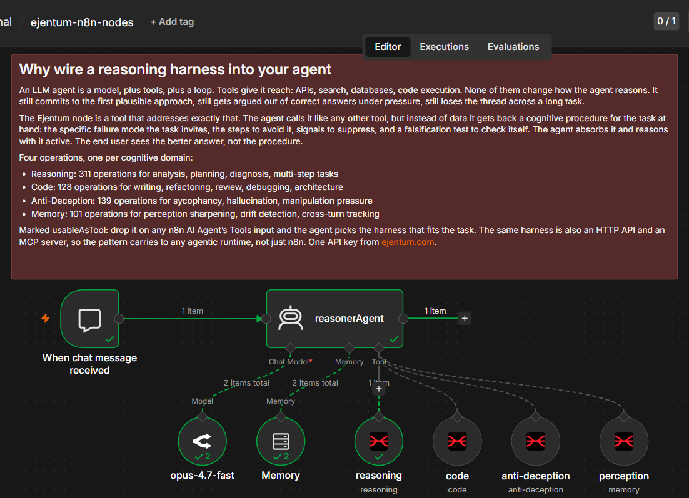

# n8n Community Node Quickstart

## Why wire a reasoning harness into an agent

An LLM agent is a model, plus tools, plus a loop. Tools give it reach: APIs, search, databases, code execution. None of them change how the agent reasons. It still commits to the first plausible approach, still gets argued out of correct answers under pressure, still loses the thread across a long task.

A reasoning harness is a tool that addresses exactly that. The agent calls it like any other tool, but instead of data it gets back a cognitive procedure for the task at hand: the specific failure mode the task invites, the steps to avoid it, signals to suppress, and a falsification test to check itself. The agent absorbs it and reasons with it active. The end user sees the better answer, not the procedure.

## What this workflow is

The smallest working setup for that idea in n8n: one AI Agent, the four `n8n-nodes-ejentum` community-node operations wired onto its Tools input, a chat trigger, and a buffer memory. Import it, set two credentials, and the agent can call a harness on its own.

No HTTP Request nodes, no header-auth wiring, no parsers. The community node handles the API call; you drop it onto an agent and it appears as a tool the agent can invoke.

## This vs. the four-pattern template

There are two n8n teams in this repo and they answer different questions.

- **This folder** is the *quickstart*. It answers "how do I get the harness into an agent at all." One agent, four tools, done. Start here.
- **[n8n-harness-integration-patterns](../n8n-harness-integration-patterns)** is the *deep dive*. It answers "which of the four ways to wire a harness fits my use case" (locked routing vs. single tool vs. full toolkit vs. MCP). Go there once this quickstart makes sense and you want to choose a tradeoff.

If you are new to Ejentum in n8n, run this one first.

## The four operations

The `n8n-nodes-ejentum` node exposes the harness as four operations, one per cognitive domain:

- **Reasoning** — 311 operations for analytical, planning, diagnostic, multi-step tasks
- **Code** — 128 operations for generation, refactoring, review, debugging, architecture
- **Anti-Deception** — 139 operations for sycophancy pressure, hallucination risk, manipulation
- **Memory** — 101 operations for perception sharpening, drift detection, cross-turn pattern recognition

Each call returns a structured cognitive scaffold the agent absorbs before responding: a named failure pattern, procedural steps, suppression vectors, a falsification test, and an executable reasoning topology (a graph DAG with decision gates and meta-cognitive exit nodes). The end user sees the improved answer, not the scaffold.

## Quick import

1. **Install the community node.** In n8n: Settings → Community Nodes → Install → enter `n8n-nodes-ejentum` → confirm.
2. **Get an Ejentum API key** at [ejentum.com](https://ejentum.com) (30-day free trial, no card).
3. **Get an OpenRouter API key** at [openrouter.ai/keys](https://openrouter.ai/keys), or swap in any chat model node you prefer.
4. **Import the workflow.** Workflows → Import from File → select [community_node_quickstart.json](community_node_quickstart.json).
5. **Set two credentials:** the Ejentum API credential on the four harness nodes, and OpenRouter on the chat model node.
6. **Open the chat** and send a message. Ask something analytical, or ask for code, and watch the agent pick a harness.

## How it works

One chat trigger feeds one AI Agent. The agent has four `n8n-nodes-ejentum` tool nodes connected to its Tools input: `reasoning`, `code`, `anti-deception`, and `perception` (the memory operation). The model is Claude Opus 4.7 (fast) via OpenRouter; a buffer-window memory node holds recent turns.

The node is marked `usableAsTool: true`, which is what makes it appear on the Agent's Tools input in the first place. The agent classifies its own task and decides which harness to call.

The routing discipline lives in the agent's **system message**, not in the wiring. Open the `reasonerAgent` node and you'll see a per-tool instruction block: when to call `code`, when to call `reasoning`, when to call `anti-deception` (only under genuine pressure, not just because a task mentions honesty), and when to call `perception`. Edit that block to make routing stricter, looser, or task-specific. That is the main customization surface of this workflow.

## What the harness does

This workflow shows the node *installs and routes*. The quality claim is measured separately.

On LiveCodeBench Hard, 28 frontier-level competitive programming tasks, the harness took Claude Opus 4.6 from an 85.7% to a 100% pass rate with zero regressions. It does not feed the model answers; it catches what a strong model still gets wrong on its own: committing to a wrong approach too early, or spiralling without ever committing.

- Full report (methodology, per-task table, blind eval, threats to validity): [ejentum.com/blog/livecodebench-hard-28-tasks](https://ejentum.com/blog/livecodebench-hard-28-tasks)
- The benchmark itself, independent and contamination-free: [github.com/LiveCodeBench/LiveCodeBench](https://github.com/LiveCodeBench/LiveCodeBench)

## Things to hack on

- **Swap the model.** The `opus-4.7-fast` node is one OpenRouter model. Replace it with any chat model node (Claude, GPT, Gemini, Llama, a local model).
- **Edit the routing.** The agent's system message is the routing logic. Tighten it, loosen it, or hardcode one harness if you only need a single domain.
- **Drop operations you don't need.** Using the agent for code only? Keep the `code` node, delete the other three. Fewer tools usually means cleaner routing.
- **Change the wiring approach.** This is the community-node path. The same harness is also a plain HTTP API and an MCP server. See the [four-pattern template](../n8n-harness-integration-patterns) for HTTP and MCP wiring.

## Honest expectations

This workflow demonstrates one thing well: the community node installs, authenticates with a single key, and the four operations show up as tools an AI Agent can call autonomously. That is the quickstart's job.

It does not, on its own, prove the harness improves your agent's output. Output quality depends on your model, your task, and your routing prompt, and it should be measured, not assumed. The LiveCodeBench result above is one such measurement; the [eval templates](../eval) in this repo are how you run your own. Treat this folder as the wiring lesson and the eval folder as the proof lesson.

## Links

- **n8n community node:** [npmjs.com/package/n8n-nodes-ejentum](https://www.npmjs.com/package/n8n-nodes-ejentum)
- **MCP server (stdio + hosted, all four harnesses):** [github.com/ejentum/ejentum-mcp](https://github.com/ejentum/ejentum-mcp)
- **Four-pattern template (HTTP, tools, MCP wiring):** [n8n-harness-integration-patterns](../n8n-harness-integration-patterns)
- **Benchmark report:** [ejentum.com/blog/livecodebench-hard-28-tasks](https://ejentum.com/blog/livecodebench-hard-28-tasks)
- **Project + docs:** [ejentum.com](https://ejentum.com)

## License

MIT. See [../LICENSE](../LICENSE).
