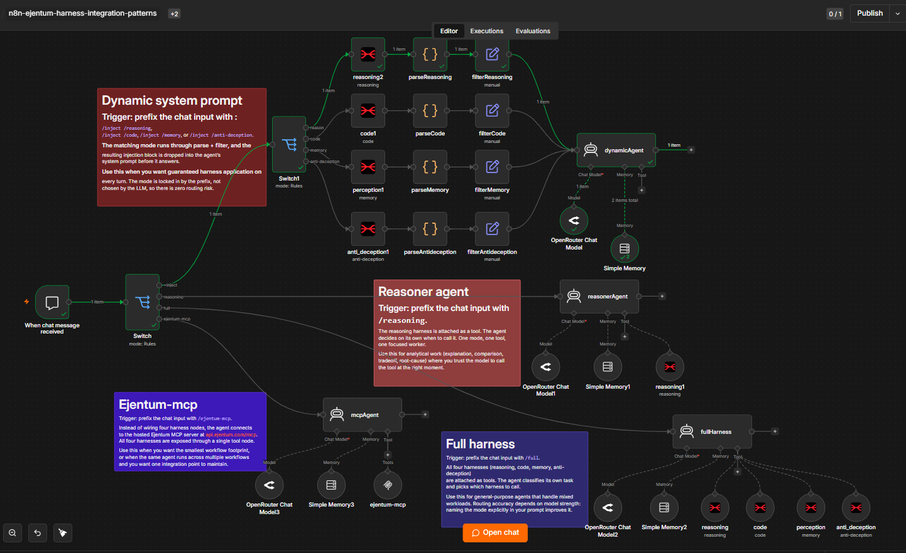

# Harness Integration Patterns (n8n)

## What this is

Four ways to wire a reasoning harness into an n8n agent, each with a different control vs. flexibility tradeoff. One importable workflow, one chat trigger, four branches you select by prefixing your message.

Most n8n templates show you one wiring pattern and call it done. This one says: pick your tradeoff. The four branches span the routing-discretion axis from "you decide" to "the model decides."

| Branch | Trigger prefix | Who picks the mode | Coverage | Wiring weight |
|---|---|---|---|---|
| Dynamic system prompt | `/inject /reasoning` (or `/code`, `/memory`, `/anti-deception`) | You, via prefix | One mode per turn | Four HTTP nodes + parse + filter per mode |
| Reasoner agent | `/reasoning` | Model decides when | One mode | One HTTP tool node |
| Full harness | `/full` | Model decides which + when | All four modes | Four HTTP tool nodes |
| Ejentum-mcp | `/ejentum-mcp` | Model decides which + when | All four modes | One MCP Client node |

## Quick import

1. In n8n, open the workflow list and click **Import from File**.
2. Select [harness_integration_patterns.json](harness_integration_patterns.json).
3. Set up credentials (below).
4. Click **Open chat** at the bottom of the editor and send `/inject /reasoning hello` (or any of the other prefixes) to test.

## Credentials

| Credential | Used by | Get it |
|---|---|---|
| OpenRouter API | All four agents (Chat Models) | https://openrouter.ai/keys |
| Ejentum (Header Auth) | `reasoning2`, `code1`, `perception1`, `anti_deception1`, `reasoning1`, and the four `fullHarness` tools | Name: `Authorization`. Value: `Bearer <your_ejentum_key>`. Key from [ejentum.com](https://ejentum.com) (100 free calls, no card). |
| Bearer Auth | `ejentum-mcp` MCP Client node | Same Ejentum key, configured as Bearer Auth on the MCP node. Endpoint: `https://api.ejentum.com/mcp`. |

The example workflow uses one OpenRouter credential across all chat models. If you prefer different providers per branch, swap the chat model node on each agent independently.

## The four patterns, in detail

### 1. Dynamic system prompt

**Trigger:** prefix the chat input with `/inject /reasoning`, `/inject /code`, `/inject /memory`, or `/inject /anti-deception`.

The matching mode runs through parse + filter, and the resulting injection block is dropped into the agent's system prompt before it answers. The mode is locked in by the prefix, not chosen by the LLM, so there is zero routing risk.

Each branch is three nodes in sequence: an HTTP Request that calls the API in that mode, a Code node (`parseReasoning`, `parseCode`, `parseMemory`, `parseAntideception`) that splits the bracketed scaffold into separate fields, and an Edit Fields node (`filterReasoning`, `filterCode`, `filterMemory`, `filterAntideception`) that assembles the final injection block from those fields.

The parse-then-filter split exists so you can remix the injection. Open `filterReasoning` and you'll see each bracket exposed as a drag-and-drop field (`negative_gate`, `procedure`, `reasoning_topology`, `target_pattern`, `falsification_test`, `amplify`, `suppress`). Drop fields, reorder them, or pull fields from another mode's parse node to build hybrid injections. The parser-per-mode design is what makes this remix surface usable.

Use this branch when you want guaranteed harness application on every turn and full control over what reaches the model.

### 2. Reasoner agent

**Trigger:** prefix the chat input with `/reasoning`.

The reasoning harness is attached to the agent as one HTTP tool. The agent decides on its own when to call it. One mode, one tool, one focused worker.

Use this for analytical work (explanation, comparison, tradeoff, root-cause) where you trust the model to call the tool at the right moment. The agent's system prompt is the routing logic; tune it to make tool-calling more or less aggressive.

### 3. Full harness

**Trigger:** prefix the chat input with `/full`.

All four harnesses are attached as separate HTTP tools (`reasoning`, `code`, `perception`, `anti_deception`). The agent classifies its own task and picks which harness to call.

Use this for general-purpose agents that handle mixed workloads. Routing accuracy depends on model strength: weaker models confuse anti-deception with memory, or stack tools that didn't need stacking. Naming the mode explicitly in your user prompt ("use the code harness on this") raises routing accuracy without changing the wiring.

### 4. Ejentum-mcp

**Trigger:** prefix the chat input with `/ejentum-mcp`.

Instead of wiring four HTTP tool nodes, the agent connects to the hosted Ejentum MCP server at `https://api.ejentum.com/mcp` via the MCP Client node. All four harnesses are exposed through a single tool node.

Functionally equivalent to the full-harness branch for the agent's behavior, but the workflow footprint is much smaller. Use this when the same agent runs across multiple workflows and you want one integration point to maintain, or when you want to keep n8n templates clean as the harness catalog grows.

## Picking the right branch

| If you want... | Use |
|---|---|
| Determinism (always apply the harness, same way every time) | Dynamic system prompt |
| One specific cognitive mode wired in for the model to use at its discretion | Reasoner agent |
| The model to pick from all four harnesses based on the task | Full harness |
| Same as full harness, fewer nodes, single integration point | Ejentum-mcp |

When in doubt, start with **Reasoner agent** for narrow tasks and **Ejentum-mcp** for general-purpose agents. Both keep the workflow small. Move to **Dynamic system prompt** when routing reliability matters more than agent autonomy.

## Things to hack on

- **Remix the injection.** Open any `filter*` Edit Fields node and reorder, drop, or replace the expressions with fields pulled from a different mode's parse node. The parsers expose every bracket as its own drag-and-drop field for exactly this.
- **Add a fifth branch.** Duplicate any of the four, change the chat prefix, and customize. Common additions: a stacked branch that calls two modes in sequence (e.g. `/stack /reasoning /anti-deception`), or a branch that routes on content classification instead of prefix.
- **Swap the chat model.** Each branch has its own OpenRouter Chat Model node. Replace any of them with Claude, GPT-4.1, Gemini, Llama, or whatever else you want. The four patterns are model-agnostic.
- **Change the MCP endpoint.** The `ejentum-mcp` node points at the hosted server, but you can also run `npx -y ejentum-mcp` locally as a stdio MCP server if you prefer. See [ejentum-mcp](https://github.com/ejentum/ejentum-mcp) for the install paths.
- **Add observability.** Drop a Code or Edit Fields node after each agent to log which branch was hit, which mode was chosen (for the model-discretion branches), and how often. Useful when comparing routing accuracy across model providers.

## Honest expectations

The four patterns are not equivalent in behavior, just in capability. The model-discretion branches (Reasoner, Full, MCP) depend on the chat model's tool-calling reliability. Strong models (GPT-4.1, Claude Sonnet 4.x, Gemini 3 Pro) route well. Weaker models route poorly, especially on cold prompts that don't explicitly name the failure mode you want addressed.

If you measure the four branches on the same prompt, you will sometimes get four different answers. That's the tradeoff surface. The dynamic-system-prompt branch is the closest to "the harness was definitely applied"; the others are "the harness was available, the model decided."

## Learn more about the Ejentum tool

The harness nodes in this workflow call Ejentum's Logic API. None of the links below are required to run the workflow, but they explain what the tool is and how to call it from your own n8n flows:

- **Home + free key (100 calls, no card):** [ejentum.com](https://ejentum.com)
- **n8n integration guide (HTTP node setup, header auth, mode selection, screenshots):** [ejentum.com/docs/n8n_guide](https://ejentum.com/docs/n8n_guide)
- **API reference (request/response shape, mode catalog):** [ejentum.com/docs/api_reference](https://ejentum.com/docs/api_reference)
- **ejentum-mcp (MCP server, stdio + hosted HTTPS):** [github.com/ejentum/ejentum-mcp](https://github.com/ejentum/ejentum-mcp)
- **Per-harness docs:** [Reasoning](https://ejentum.com/docs/reasoning_harness) · [Code](https://ejentum.com/docs/code_harness) · [Anti-Deception](https://ejentum.com/docs/anti_deception) · [Memory](https://ejentum.com/docs/memory_harness)

## License

MIT. See [../LICENSE](../LICENSE).
